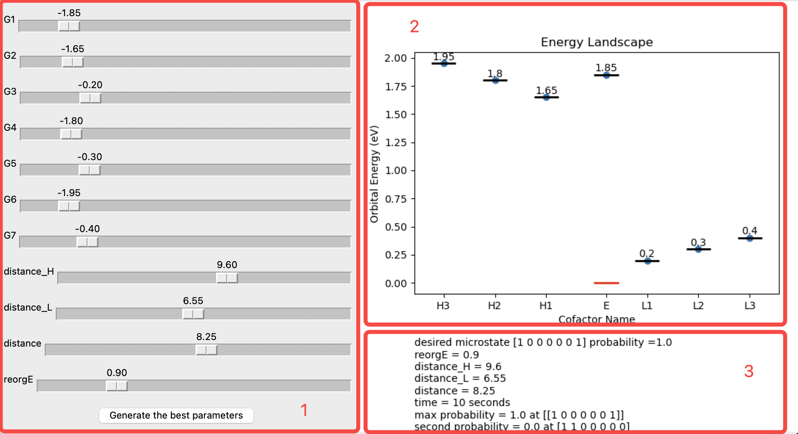

# Hole Bifurcation Simulation \& Visualization Toolkit

This project provides a Python-based GUI for **visualizing and optimizing parameters** related to electron and hole bifurcation design. It incorporates **Bayesian Optimization** to find optimal parameter configurations for maximizing final yields under specific physical constraints.

This repository provides tools for simulating and visualizing hole bifurcation kinetics using master equation approaches. It also contains some helpful codes for often-use MD analysis, since many of the parameters for MEK needs to be obtained from a molecular dynamic simulation (MD). The repository includes:
* GUI.py: A graphical user interface for visualizing energy landscapes and optimizing parameters.
* MEK_vib.py: A backend module for computing the hole bifurcation kinetics and related metrics using advanced algorithms and master equation methods.
* analysis.ipynb: Some useful MDAnalysis tool functions that can be used to analyze MD trajectories. 
---

## Features

- **Interactive Sliders**: Dynamically adjust parameters like energy levels, distances, and reorganization energy.
- **Bayesian Optimization**: Automate the process of finding optimal parameter configurations for maximum yield.
- **Real-Time Visualizations**: Energy landscapes and efficiency metrics are updated live with parameter changes.
- **Constraint Enforcement**: Ensure physically valid parameters, such as:
  - $G_6 \leq G_1$
  - $G_6 < G_7$
- **Customizable Codebase**: Modify the optimization criteria and constraints according to research needs.

---

## Installation

### Prerequisites
- Python 3.8 or higher
- Required Python packages (install using pip):
    ```bash
    pip install -r requirements.txt
    ```

### Steps to Run
1. Clone this repository:
    ```bash
    git clone https://github.com/your-repo-name/electron-bifurcation-gui.git
    cd electron-bifurcation-gui
    ```
2. Install the dependencies:
    ```bash
    pip install -r requirements.txt
    ```
3. Run the GUI:
    ```bash
    python GUI.py
    ```

---

## GUI Overview

### Parameter Sliders
- Modify key parameters interactively:
  - **Energy Levels (G1, G2, ..., G7)**: Energy (in eV) of cofactors.
  - **Distances (distance_H, distance_L, distance)**: Edge-to-edge distances (in Å).
  - **Reorganization Energy (reorgE)**: Electron transfer reorganization energy (in eV).

### Visualization
- **Energy Landscape**: Displays orbital energy as a function of cofactor distance.
- **Text Metrics**: Displays probabilities, energy efficiencies, and total efficiency.

### Optimization
- Clicking **"Generate the best parameters"** applies Bayesian Optimization to maximize the final yield while maintaining constraints.

---

## Code Structure

- **`hole_transfer` Function**: Simulates bifurcation using the `Network` object, computing final yield, probabilities, and total efficiency.
- **`function_to_optimize` Function**: Defines the optimization objective for Bayesian Optimization.
- **`generate_best_parameters` Function**: Applies optimization and updates GUI sliders and plots.
- **`update_plot` Function**: Updates visualization plots and textual outputs dynamically.

---

## Parameter Constraints

The model enforces constraints to ensure physical validity:
- **Energy Levels**:
  - $G_6 \leq G_1$
  - $G_6 < G_7$
- **Distance Bounds**:
  - $\text{distance}_H, \text{distance}_L, \text{distance} \in [5, 15]$ (Å)
- **Reorganization Energy**:
  - $\text{reorgE} \in [0.7, 0.9]$ (eV)

---
## MEK_vib.py: Hole Bifurcation Kinetics

### Master Equation Analysis

The master equation framework provides a detailed kinetic model for the probability distribution of electron and hole states in a network of cofactors. This approach captures the dynamics of transitions between microstates, where each microstate corresponds to a specific distribution of charges among the cofactors.

#### Microstate Definition

We define a microstate  $S_i$  as a vector describing the occupation of  N  cofactors:
```math
\mathbf{S_i} = [n_1, n_2, …, n_N]
```
where  $n_k$  (for  $k = 1, 2, \dots, N$ ) is the occupation number of cofactor $C_k$ . The number can be  0  or  +1 , representing the absence or presence of a hole on the site.

#### The Master Equation

The evolution of the probability vector $ \mathbf{P}(t)$ , which contains the probabilities of all microstates at time  $t$ , is governed by the master equation:
```math
\frac{d\mathbf{P}(S_i, t)}{dt} = \sum_{j} K_{ij}P(S_j, t) - K_{ji}P(S_i, t)
```
where:
* $K_{ij}$  is the rate of transition from microstate $S_j$  to  $S_i$,
* $K_{ji}$  is the reverse transition rate.

The solution to this equation is expressed as:
$$\mathbf{P}(t) = e^{\mathbf{K}t} \mathbf{P}(0),$$
where  $\mathbf{K}$  is the transition rate matrix:
```math
\mathbf{K} =
\begin{bmatrix}
k_{11} & k_{12} & k_{13} & \cdots \\
k_{21} & k_{22} & k_{23} & \cdots \\
k_{31} & k_{32} & k_{33} & \cdots \\
\vdots & \vdots & \vdots & \ddots
\end{bmatrix}.
```

The diagonal elements are defined to conserve total probability:
$$k_{ii} = -\sum_{j \neq i} k_{ji}.$$

#### Transition Rate Calculation

Transition rates are computed using Marcus theory, incorporating contributions from both low-frequency (outer sphere) and high-frequency (inner sphere) vibrational modes:
$$k_{i \rightarrow j} = \frac{2\pi}{\hbar} \langle V_{ij}^2 \rangle \frac{1}{\sqrt{4\pi \lambda_{ij} k_B T}} \sum_n \frac{e^{-D}}{n!} D^n \exp\left[-\frac{\left(\Delta G_{ij} + \lambda_{ij} + n\hbar\omega\right)^2}{4\lambda_{ij} k_B T}\right].$$
Here:
* $\langle V_{ij}^2 \rangle$: thermally averaged electronic coupling,
* $\lambda_{ij}$: reorganization energy,
* $k_B$ : Boltzmann constant,
* $T$ : temperature,
* $\Delta G_{ij}$ : standard reaction free energy,
* $\hbar\omega$: high-frequency vibrational quantum energy,
* $D$ : Huang-Rhys factor,  $D = \frac{\lambda_{\text{in}}}{\hbar\omega}$,
* $\lambda_{\text{in}}$: high-frequency reorganization energy.

The electronic coupling is modeled using an exponential decay:
$$V_{ij} = V_0 e^{-\beta R_{ij}},$$
where  $\beta $ is the tunneling decay constant and  $R_{ij}$  is the donor-acceptor distance.

### Features of MEK_vib.py
1. Master Equation Solver:
  * Constructs and solves the master equation for a network of cofactors using Python’s numerical libraries.
2. State Transition Dynamics:
  * Computes transitions between microstates based on physical parameters such as reorganization energy, coupling constants, and free energy changes.
3. Reservoir Coupling:
  * Models interactions between cofactors and external electron/hole reservoirs using detailed balancing principles:
$$\frac{k_{\text{forward}}}{k_{\text{backward}}} = e^{-\beta \Delta G}.$$
4. Visualization and Analysis:
  * Includes functions for visualizing population dynamics, state transitions, and fluxes over time.
5. Stochastic Simulation:
  * Implements Gillespie’s algorithm for stochastic simulation of electron transfer processes.

### Example Workflow

	1.	Construct a Network:
	•	Define cofactors, their redox states, and connections.
	2.	Set Transition Parameters:
	•	Specify reorganization energies, distances, and coupling constants.
	3.	Simulate Dynamics:
	•	Use the master equation solver to compute time-dependent populations or run stochastic simulations for specific trajectories.
	4.	Analyze Results:
	•	Extract kinetic rates, population distributions, and quantum yields for the bifurcation process.
## Example Outputs

### GUI Example


---

## How to Contribute

We welcome contributions! Here's how you can help:
1. Fork the repository.
2. Create a new branch (`feature/new-feature`).
3. Submit a pull request with a detailed explanation.

---

## License

This project is licensed under the MIT License. See the `LICENSE` file for details.

---

## Contact

For questions or feedback, reach out:
- **Name**: Xiao Huang
- **Email**: xiao.huang@duke.edu

---